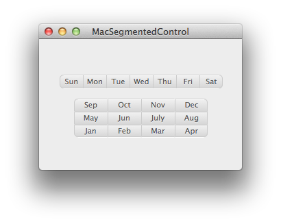

# FRSegmentedControl
FRSegmentedControl is a Cocoa control for Mac that can be used in one of two ways:

1. As a stylized radio selection
2. As a set of switches that a user can turn on and off

The project has two examples – a weekday selector and a month selector. The weekday selector is an example of the first use case, and the month selector is an example of the second.

The FRSegmentedControl uses delegation and a datasource modeled off of UITableView.

## License

FRSegmentedControl is distributed under the [MIT License](http://www.opensource.org/licenses/mit-license.php). Enjoy!